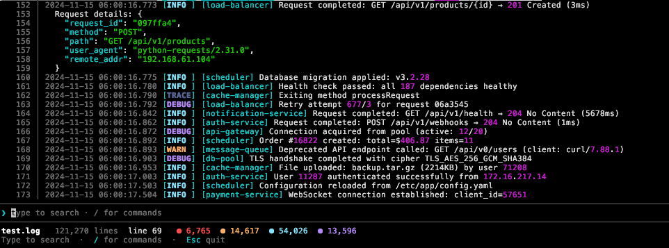

# loghew

A TUI log viewer built with Rust.



## Install

```sh
curl --proto '=https' --tlsv1.2 -LsSf https://github.com/nehadyounis/loghew/releases/latest/download/loghew-installer.sh | sh
```

Or build from source:

```sh
git clone https://github.com/nehadyounis/loghew.git
cd loghew
cargo install --path .
```

## Usage

```sh
loghew server.log          # open a log file
loghew +100 server.log     # open and jump to line 100
cat app.log | loghew       # pipe from stdin
loghew -s "error" app.log  # open with a search
```

## Commands

Type `/` in the viewer to access commands:

| Command | Description |
|---------|-------------|
| `/search` | Case-insensitive text search |
| `/regex` `/r` | Regex search |
| `/filter` `/fi` | Filter lines (e.g. `/fi ERROR !debug`) |
| `/time` `/t` | Jump to time (`/t 14:30`, `/t -5m`) |
| `/go` `/g` | Go to line or bookmark |
| `/bookmark` `/b` | Bookmark current line |
| `/bookmarks` `/bs` | List bookmarks |
| `/follow` `/f` | Tail mode — auto-scroll on new lines |
| `/notify` `/n` | Desktop notification on pattern match |
| `/delta` `/d` | Show time deltas between lines |
| `/color` `/c` | Color lines by log level |
| `/wrap` `/w` | Toggle line wrapping |
| `/config` | Edit settings (theme, scroll speed, etc.) |

## Features

- **Large file support** — memory-mapped I/O for files over 10MB, lazy line indexing
- **Search & filter** — literal and regex search, multi-condition filters with negation
- **Time navigation** — auto-detects timestamps, jump by absolute or relative time
- **Bookmarks** — name them, list them, jump between them
- **Notifications** — watch for patterns and get desktop alerts on new matches
- **Themes** — dracula, nord, gruvbox, monokai, solarized, catppuccin, tokyo-night
- **Mouse support** — click, drag to select, copy to clipboard
- **Tail mode** — follow growing log files in real time
- **Stdin** — pipe logs directly into loghew

## Config

Settings live in `~/.config/loghew/config.toml`:

```toml
[general]
scroll_speed = 3
line_numbers = true
mouse = true
theme = "dracula"
wrap = false
semantic_color = false

[colors]
error = "#ff5555"
warn = "yellow"
info = "cyan"
debug = "magenta"
trace = "gray"
```

## License

[MIT](LICENSE)
